# 中山大学计算机学院本科生实验报告

## 实验名称:Lecture 6
 
教学班级|专业（方向）|学号|姓名
-|-|-|-
2班|计算机科学与技术|21307174|刘俊杰	

## 实验目的
* 熟悉SQL的有关视图的操作，
* 能够使用SQL语句创建需要的视图，对视图进行查询和取消视图。
## 练习
(1)定义选课信息和课程名称的视图 VIEWC;
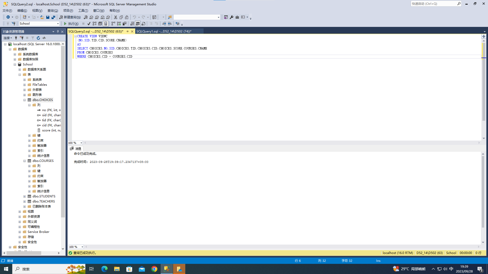
(2)定义学生姓名与选课信息的视图 VIEWS;
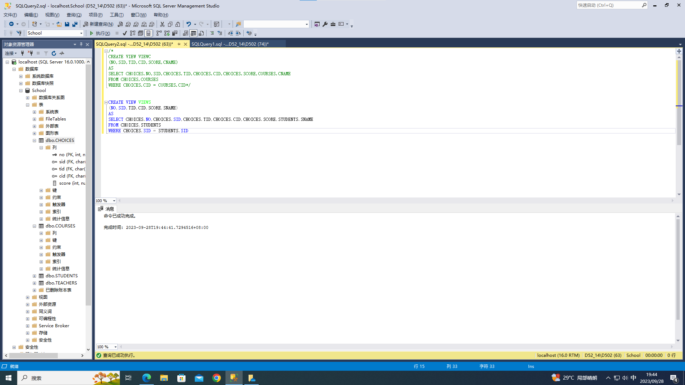
(3)定义年级低于1998的学生的视图S1(SID, SNAME, GRADE);

(4)查询学生为“ uxjof”的学生的选课信息;
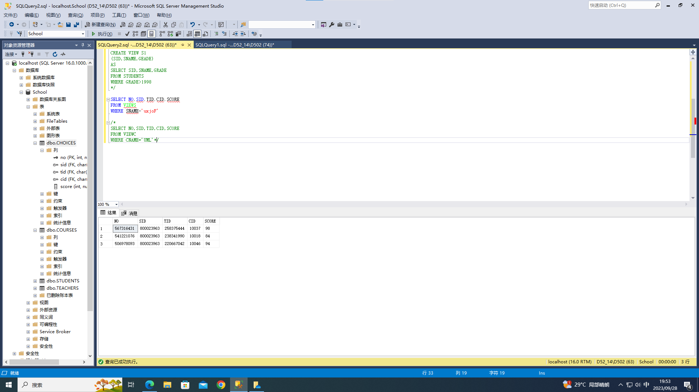
(5)查询选修课程“UML”的学生的编号和成绩;
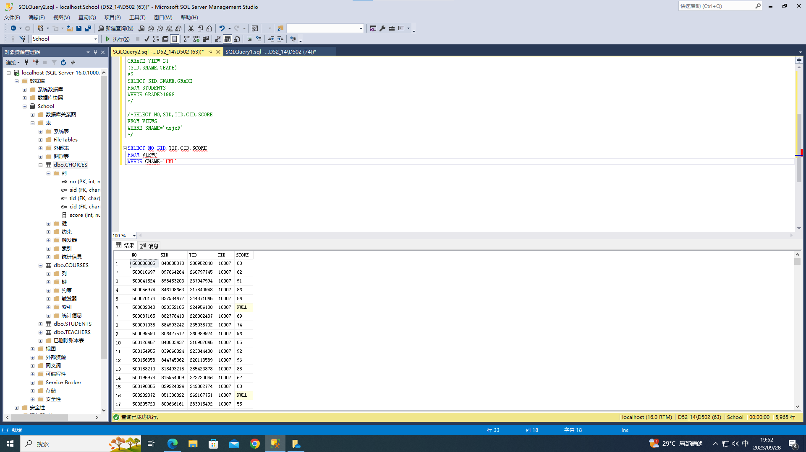
(6)向视图S1插入记录(60000001,Lily,2001);
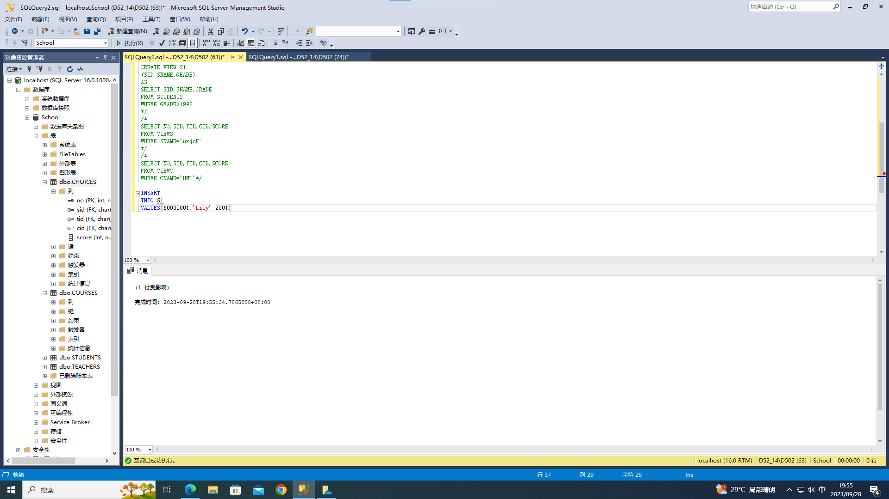
(7)定义包括更新和插入约束的视图S1,尝试向视图插入记录(60000001,Lily,1997),删
除所有年级为1999的学生记录,讨论更新和插入约束带来的影响。
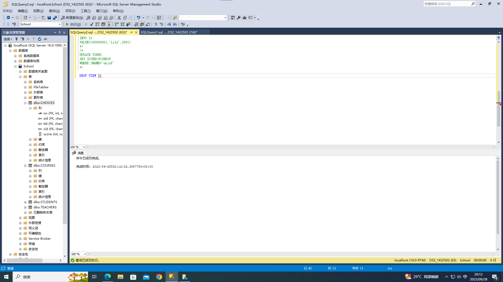
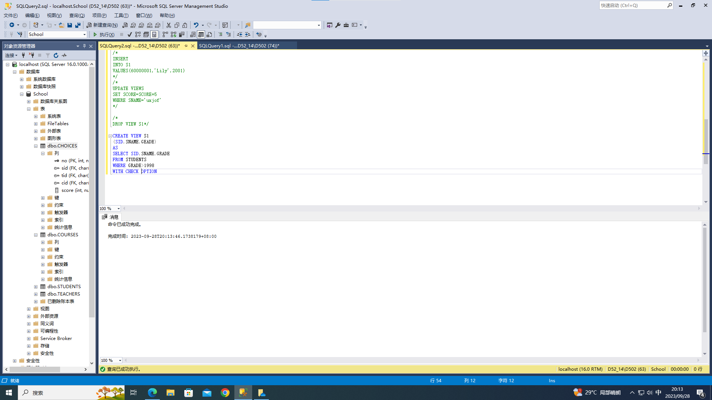
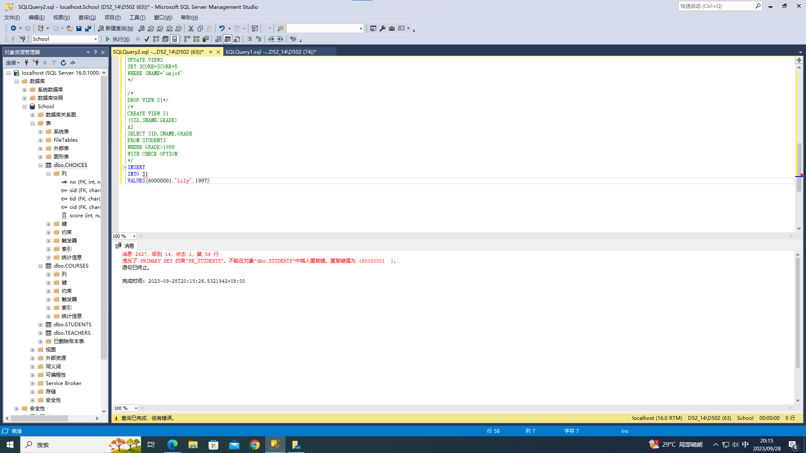

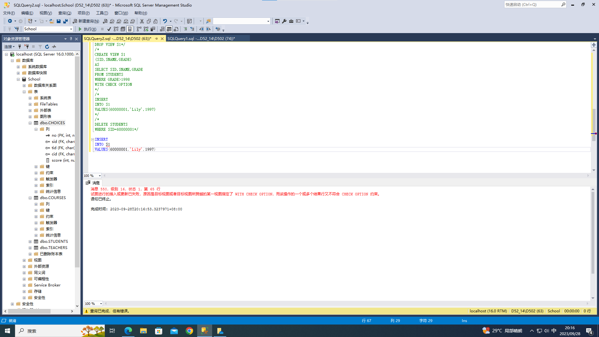
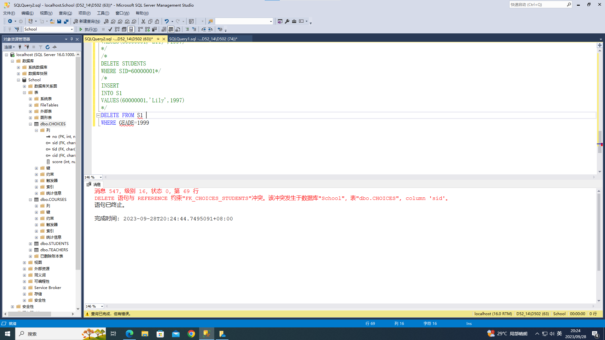
(8)在视图 VIEWS中将姓名为“ uxjof”的学生的选课成绩都加上5分。
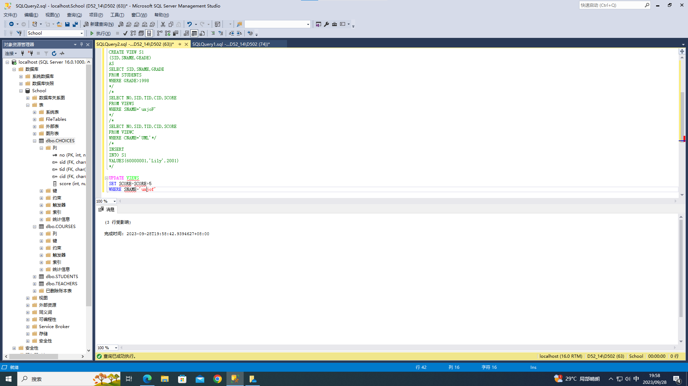
(9)取消以上建立的所有视图
